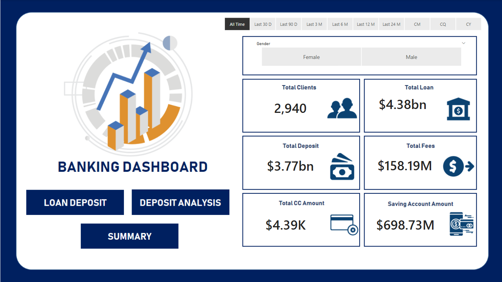
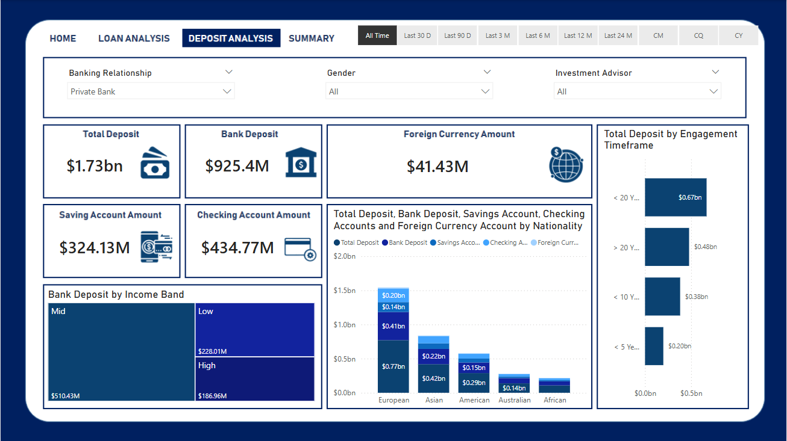
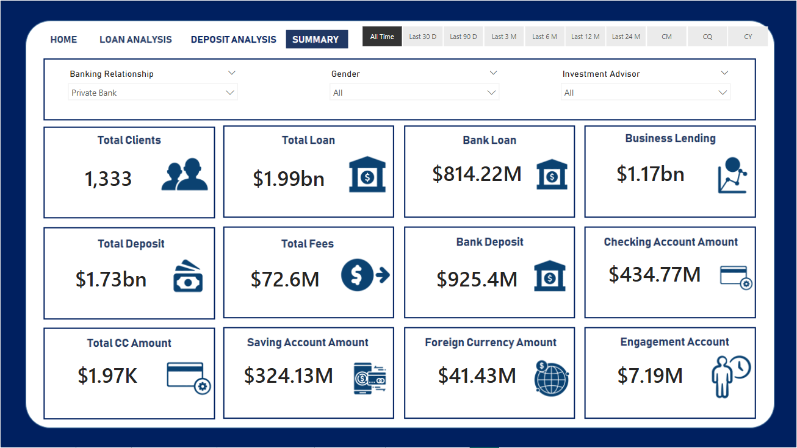

# 🏦 Banking Dashboard – End-to-End Data Analytics Project  

This project demonstrates how raw banking data can be transformed into **actionable insights** using SQL for data wrangling and Power BI for visualization. It covers the **entire data analysis lifecycle** — from data extraction and cleaning, to exploratory analysis, to creating a dynamic, multi-page dashboard that enables decision-makers to uncover customer and financial trends.  

---

## 🔄 Project Workflow  

**Raw Data** ➝ **MySQL (Storage & Cleaning)** ➝ **EDA & Transformation** ➝ **Power BI (Dashboard & Insights)**  

---

## 📊 Dataset Overview  

- **Records**: Thousands of customer and transaction entries  
- **Columns**: 24 features (both categorical and numerical)  
- **Source**: MySQL database  
- **Key Features**: Demographics, loan information, deposits, account balances, estimated income, superannuation savings  

---

## 🧹 Step 1: Data Cleaning & Preparation  

- **Categorized Income into Bands** for better segmentation:  
  - `Low`  
  - `Mid`  
  - `High`  
- **Standardized categorical values**: gender, nationality, and branch codes.  
- **Created conditional columns in Power BI** to derive meaningful categories.  
- **Mapped values for readability**:  
  - Gender: `1 → Male`, `2 → Female`  
  - Branch Codes: replaced `'1'`, `'2'`, etc. with full branch names.  
- **Handled missing values** and ensured consistency across all variables.  

---

## 🔎 Step 2: Exploratory Data Analysis (EDA)  

Performed a **two-fold analysis** to uncover trends and patterns:  

### 🔹 Categorical Analysis  
- Gender distribution of customers  
- Nationality trends across loans and deposits  

### 🔹 Numerical Analysis  
- Credit card balances  
- Bank loan distribution  
- Deposit balances (checking, savings, foreign currency)  
- Estimated income and spending power  
- Superannuation savings  

---

## 💡 Step 3: Key Insights  

- 📈 **High cross-account correlation**: Customers with substantial deposits in one account (e.g., checking) tend to maintain high balances across other accounts (savings, foreign currency).  
- 🏦 **Customer segmentation**: Clear differentiation in financial behavior across income bands (`Low`, `Mid`, `High`).  
- 🔍 **Demographic patterns**: Gender and nationality influence in product adoption and loan uptake.  

---

## 📊 Step 4: Power BI Dashboard  

Built a **multi-page interactive dashboard** to showcase insights:  

### ✅ Page 1: **Home – Overview**  
> Provides a snapshot of the bank’s customer base, income bands, and high-level statistics.  

  

---

### ✅ Page 2: **Loan Analysis**  
> Examines loan distribution, types of borrowers, and customer profiles influencing loan uptake.  

  

---

### ✅ Page 3: **Deposit Analysis**  
> Deep dive into deposits across account types, balance segmentation, and correlation analysis.  

  

---

### ✅ Page 4: **Summary – Final Insights**  
> Consolidates EDA findings: cross-account correlations, customer demographics, and income band trends.  

  

---

## ⚙️ Tools & Technologies  

- **Database**: MySQL  
- **Visualization**: Power BI  
- **Languages**: SQL, DAX  
- **Other Skills**: Data Wrangling, Data Cleaning, Dashboard Design  

---

## 🎯 Learnings & Takeaways  

- Gained hands-on experience in **SQL for data transformation and cleaning**.  
- Learned to **design conditional columns and calculated fields** in Power BI.  
- Practiced **building end-to-end ETL workflows**.  
- Developed skills in **storytelling with data** by presenting complex financial information in a simple, interactive dashboard.  

---

✨ This project highlights the ability to transform raw banking data into **actionable business insights** through a structured analytics workflow.  
